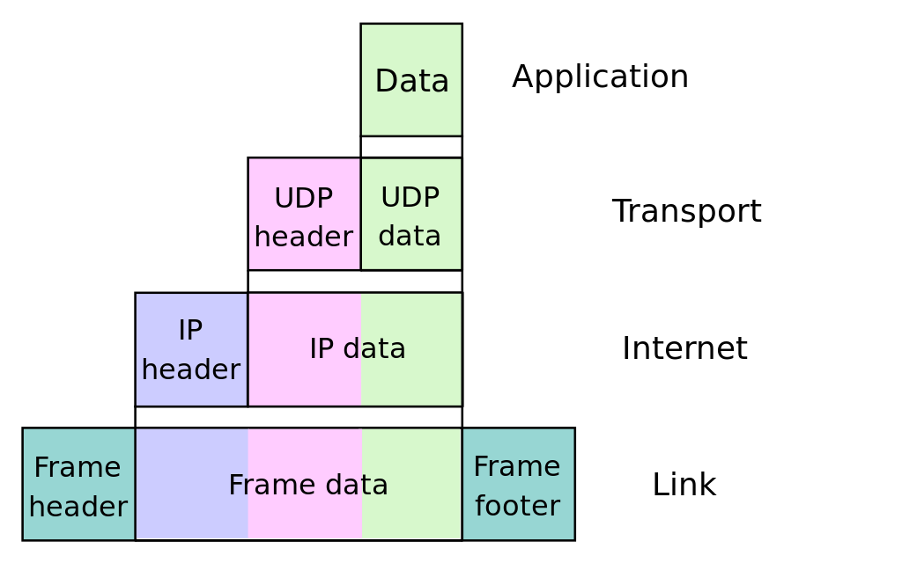
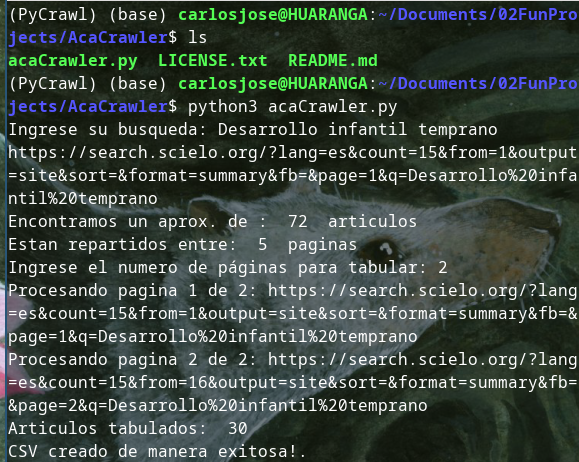
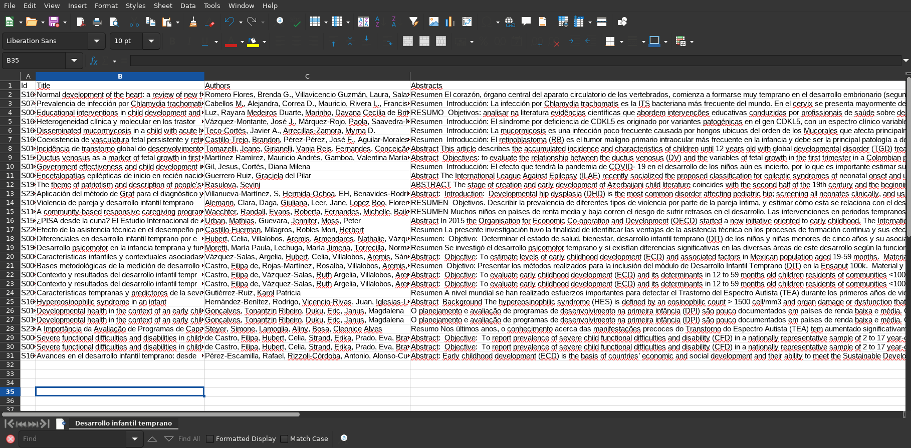

# AcaCrawler: A web crawler and scraper for latin american open access journals

## Introduction:

AcaCrawler was inspired by the work of [Jorge Martínez's](https://github.com/jorgehmartinez/scraping_thesis), and started as an exercise for our [group](https://github.com/BehData). A "web crawler" is a script which instructs your machine to "visit" a webpage and then visit more pages based on the html contents from it. On the other side of the coin, we have "web scrapers", which use the visited pages to "scrape" or download specific data based on the script variables. 

AcaCrawler is a project which goal is to allow researchers to easily tabulate key data from search topics based on the current academic discussion from Latin American Open Access journals. While for the current iteration of the project, it scrapes content based on the SciELO website, I expect to further this development into Redalyc and then other journals, any experience in Selenium will be greatly appreciated. 

This article was made to explain the logic and process behind how AcaCrawler work, and it doesn't intend to work as a README.md. If you want instructions and the full project, visit [the repo](https://github.com/dcalenzani/AcaCrawler). 

## Explaining the structure of a WebApp

To understand how AcaCrawler works we need to understand first a little bit of how we get to "see" web pages on our browser (Chrome, Firefox, Safari, Edge, etc.). This will in turn let us understand the subtleties of web crawling and web scraping. So ... what is the web? The  comprehends an ordered network of computers all around the world, which communicate to eachother using two protocols, commonly known as TCP/IP. Every computer in the world has its own "signature" and every webpage is "saved" in some computer somewhere. This is why you'll hear sometimes _there is no cloud, is just someone elses computer_.

The TCP/IP works in four levels of abstraction, but we'll focus on level 4 for our handling of web applications. In computer science, each level of abstraction means more work is being "hidden" behind levels under it. Level 4 is called the "application level" and its where most of the interactions between web browsers and information happens. If you are familiar with the OSI model, level 4 can be seen as a combination from levels 5 to 7. Said in another way, when you open your favourite browser you are entering the internet through what is called an "application" or "web app", this was designed to show you certain information defined by certain variables - think for example in location, dark/light mode, cookies, session, etc.- , but this information also exists in levels "lower" than the application we can render.


*Image 1: Layers of abstraction of the TCP/IP*

For the level 4 we actually dont have only 1 protocol. Part of the amazing work of the TCP/IP is its flexibility, which allows many ways of communication at the top level. However, for internet browsing, the most common model is the HTTP (and now HTTPS) protocol, which allows transfer of data through HTML (hypertext markup). HTML is also used for rendering emails (but it uses a different protocol). On the hypertext you can specify position, colors and other effects for the text, as well as contents such as text, numbers, tables, buttons, and nowadays even modals. This is done all thanks to HTML.

For this project we are focusing on the HTML code that renders a webpage, this way we can "save" the contents of a site and then emulate them to analyze the sites data. As for 2024, most webpages don't use only HTML, but also JavaScript to render dynamic contents based on actions done by the end-user. These contents can also be scraped, but different tools are needed, as you have to "trick" the browser into thinking you are using it (or create you own browser by default). 

So, how does HTML work? The foundation of HTML is to be a semantic description tool for documents, this means any sort of text can have a set of values corresponding to their semantic tag. For example, an image in HTML would be ``, where img is the tag, while alt and href are values. If you wish to write a paragraph you could use the `<p>` tag, but remember that the text needs to be nested inside, so `<p>Hello world!</p>` would be the correct syntax. 

Finally, you can nest tags in HTML (_Observe the tags within tags within tags..._), and to learn this in a practical way, on your browser open the "developer tools" (or however your branding team decided to call it). Its usually F12 key or CTRL + SHIFT + C (Option+Command+C in Mac). Dig a little, there should be an "inspector" section which allows you to see the full HTML of the webpage.

You'll see that 2 of the bigger nests are the **<head>** and **<body>**, these contain, respectively, the metadata for the site and its contents. This means that we will focus on the contents inside the <body>. In many DevTools, on the upper options of the tool you'll find a selection tool, which allows you to pick an element of the site with your mouse. 

Take a few minutes to inspect the website and learn about the tags you don't understand. Was anything of your interest? For me, one of the funniest concepts is the <span> class ability to be nested anywhere, its just like a fun wildcard.

## Web Scraping and Web Crawling

Can you imagine the possibilites? How many sites are there that we can "Scrape" for knowledge? With AcaCrawler I wished to improve my scientific research, I always search random topics that pop to mind in academic journals, but I've lost too much time reading abstracts one by one. 

When I learnt about Web Scraping one of my first thoughts was "how can I use this?" and it wasn't until I saw one friend scraping bibliometrics for psycology thesis in Peru that I thought "This is what scraping is for". Researchers need to analyze big amounts of data and discern between the most useful contents for their objectives. Doing this can take a long time, and there aren't many tools free of access to improve this. 

With a web scraper we could, at least, map the contents of a few journals. 

With a web crawler, we could scrape many websites, using the sites url or provided HTML to visit links that are related to the project.

So AcaCrawler was born, with the intention of providing a FOSS alternative (so researchers all over the world can use it without troubles) to preliminary research. By accesing SciELO website (an open access journal), AcaCrawler can tabulate the results based on author, country, year of publication, title and abstract. The user can select a defined number of pages, which will in turn allow to limit the search if you want to save time and polish your search terms.


*Image 2: An example of AcaCrawler at work*

After using AcaCrawler for your search, the program will return a CSV file with the contents scraped from SciELO. This will help to analyze at broad strokes the current state of the art in determined contexts.

### How AcaCrawler works

Acacrawler is built in just one script, using mainly functions. As my experience, functional programming is not covered in basic courses of programming, and might be overseen in beginners work and tutorials. However, its a totally different story in the programming world, where most GitHub Open Source will show you that functions are one of the basis of modern programming. Not all programming languages are functional, but most of them have implemented some sort on functional approach in their current iterations. 

One example for this is Python, which despite being an OOP language can be used in a "functional" approach by using python functions. Lets take for example the `get_soup()` function in acacrawler.py

```
def get_soup(url_search):    
    html = urllib.request.urlopen(url_search, context=ctx).read()
    soup = BeautifulSoup(html, 'html.parser')

    return soup
```

In python, you start a function by *def*ining it, using the structure:
```
def function_name(variable):
    function = print("hello world")

    return function
```
This means that the get_soup() function will use urllib to open a webpage and read its contents; then the BeautifulSoup library is used to parse the HTML read from the site. This is our basic function to scrape the webpage, givin us sanitized versions of the HTML structure of SciELO. Using functions allows our code to follow DRY principles, making it more readable and usable in the long term, allowing you to integrate it more easily to other projects. 

All of AcaCrawler is composed by functions, so I'll explain the main one next, get_data() next. This function is the actual scraper for our code.

```
def get_data(url): 
    # Get all the tags that match certain condition of attribute
    def get_tag_and_attr(tag,attr):
        tags = get_soup(url).find_all(tag, class_=attr)      
        return tags
    
    # Get the "parent id". In Scielo, all articles tags are contained inside a <div> with a key id.
    def get_parent_id(tag):
        div_id = tag.find_parent('div', {'id': True})['id']
        return div_id
``` 
The first part of the code defines the tag and attributes. By using the `get_tag_and_attr()` function, we retrieve all the tags that match the specified condition. These tags will contain the information we need to fill the `Article` class. Then, by using the `get_parent_id()` we attack a particular problem of SciELO, which is the "id div", a parent `<div>` for every item on the HTML, which exists over every tag.

The `get_parent_id()` function will also be used inside another function (we are at a 3rd level nesting now). It was really important to me creating functions, as crawling and scraping are repetitive tasks that only variate in tag names and similar stuff.

```
    # Initiate the Article() with the name of the ID and fill it with the requested information
    def class_filler(tag, attr):
        div_id = get_parent_id(tag) # Get the parent id
        name = tag.text.strip() # Get the tag text (the contents)

        # Check if our Article already exists. If it doesn't we create it, if it does then we append the classes to the corresponding attribute.
        if div_id not in articles:
            articles[div_id] = Article()
            articles[div_id].country = div_id[-3:]
        match attr:
            case 'title':
                articles[div_id].title = name
            case 'author':
                articles[div_id].authors.append(name)
            case 'abstract':
                articles[div_id].abstracts.append(name)
            case 'DOIResults':
                articles[div_id].doi = name
        return

    # Get the data for each attribute (is there a less repetitive way of doing this?)
    for tag in get_tag_and_attr('a', 'author'):
        get_parent_id(tag)
        class_filler(tag, 'author')

    for tag in get_tag_and_attr('strong', 'title'):
        get_parent_id(tag)
        class_filler(tag, 'title')

    for tag in get_tag_and_attr('div', 'abstract'):
        get_parent_id(tag)
        class_filler(tag, 'abstract')

    for tag in get_tag_and_attr('span', 'DOIResults'):
        get_parent_id(tag)
        class_filler(tag, 'DOIResults')
    
    return articles
```

The `class_filler` function is responsible for populating an Article object with information based on a given HTML tag and attribute. Let's break down the code:

The function takes two parameters: tag and attr. tag represents an HTML tag, and attr represents the attribute of that tag that we are interested in.

The process starts by extracting the parent ID of the given tag using the get_parent_id function. This ID is stored in the div_id variable. The text content of the tag is stripped of any leading or trailing whitespace and stored in the name variable.

The function checks if the div_id already exists in the articles dictionary. If it doesn't exist, a new Article object is created and assigned to the div_id key in the articles dictionary. Additionally, the country attribute of the Article object is set based on the last three characters of the div_id.

`class_filler` then uses a match statement to determine the attribute type (attr) and assigns the name value to the corresponding attribute of the Article object. If the attribute is 'title', the name is assigned to the title attribute. If the attribute is 'author', the name is appended to the authors list attribute. If the attribute is 'abstract', the name is appended to the abstracts list attribute. If the attribute is 'DOIResults', the name is assigned to the doi attribute. This is the data needed to populate the `Articles` object, defined at the start of the script. 

```
articles = {} # Dictionary for placing Article objects

class Article:

    def __init__(self):
        self.doi = None
        self.country = None
        self.title = None
        self.authors = []
        self.abstracts = []
```

With this, we can just fill up a CSV (using our `create_csv()`) with the article class and everything will be allright (read it with the tone of [this](https://www.youtube.com/watch?v=qV9C6Am8xzk) ). Now we'll have a nice CSV with our data!

## Conclusion

Web crawling and scraping can be really fun, it involves getting to know a web site and its contents to define the most efficient path to extract this info. By using programming tools to automatize repetitive tasks that do not need supervision we can ease up our preliminary findings and obtain a useful and shareable table that contains the primary information of your searches. A useful tool for researchers can be crafted to work in many researchers, and more FOSS tools like this are needed. 


*Our product table!*

But JavaScript is still an issue to be tackled to manage to integrate more web pages. In this work I mapped [Selenium](https://www.selenium.dev/), which seems to be the prefered pythonic way to solve this issue. But while working on the [Experimental GUI](https://github.com/dcalenzani/AcaCrawler/tree/ExperimentalGUI) I also found [PyQt](), where you could emulate (or basically recreate) a internet browser where you can program interactable actions after accesing desired urls. Right now, any help on this topic would be greatly appreciated, as packaging a desktop application for multiple systems can be greatly improved by teamwork.

### Special note
For our Linux enthusiast out there, web crawling and scraping is similar to using wget command, you enter a website, you get their contents. Actually, you can even use the wget command to download an entire HTML, so you could (if you wanted to), rebuild this code on .bash and it would probably go faster? 

```
# Code for WGET an entire html
wget \
     --recursive \
     --no-clobber \
     --page-requisites \
     --html-extension \
     --convert-links \
     --restrict-file-names=windows \
     --domains website.org \
     --no-parent \
```

Bye. 