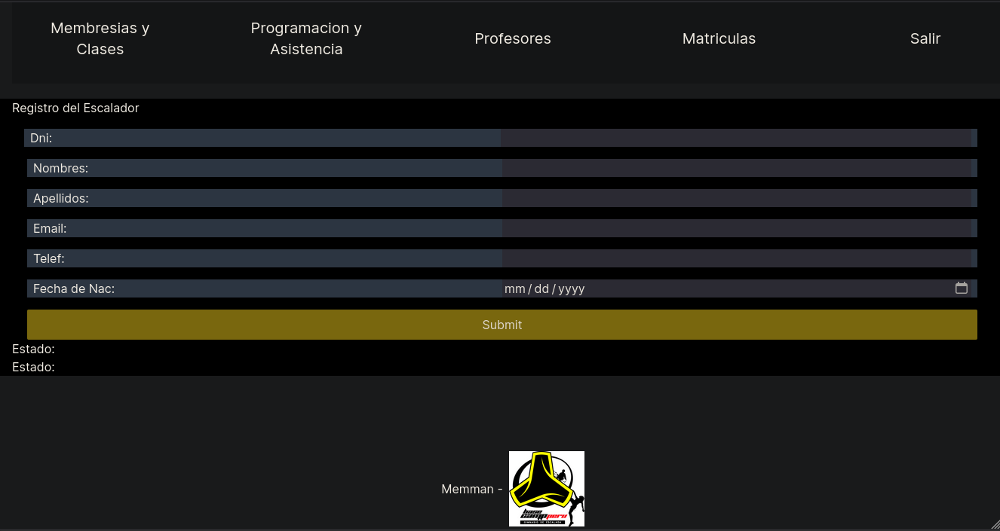
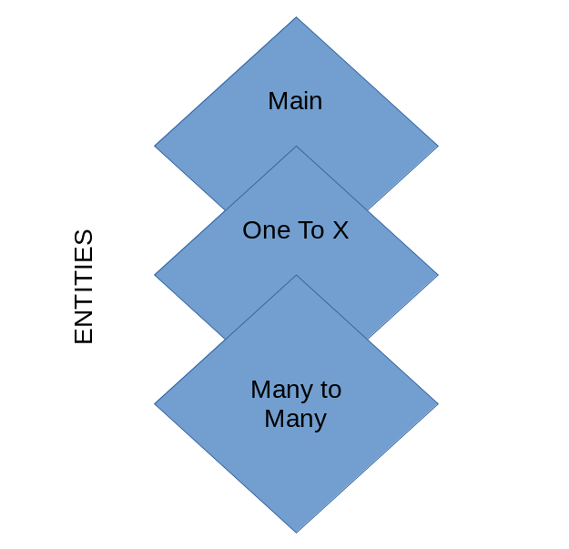

# Membership Manager

## Introduction

The Membership Manager was built as a tool for climbing gyms to manage the lessons, students and teachers. It was developed for [BaseCamp Peru](https://basecampperu.com) with the condition of doing the code public to help other small bussinesses to ease up their work. It uses PostgreSQL for the backend, working with different types of relationships. 

To check the DB Queries, please check [the repo](https://github.com/dcalenzani/memman). To check a working version check [this](https://public-memman.vercel.app) On this work I'll explain briefly the functioning of MemMan, but then we will delve into the code itself, by checking the design and logic behind the project. 

First we'll check the DB and API created for MemMan, then how it interacts with the Frontend by using NextJS and Typescript, and finally some comments about client interactions and testing. 

## MemMan at Work

MemMans primary focus is to help workers and administrators, so user interaction and experience was focused also on them. The main problem for BaseCamp was having a clean database of attendance to lessons and hours worked per teacher. This seemingly short task sums up a lot of time per day for the administration, around 15-20 hours per week, when done manually, and its prone to errors since workforce needs to manually insert student attendance as they come by, same with teacher. 

*Image 1: App Screens*

They also asked for a way to check memberships in the gym, so you would know how many days has a membership left. This allowed to create a Database structure that included also memberships and students, but added complexity to the UI since more CRUD actions where needed for different tables of the schema. Students had their knooks and cranies that needed to be tackled accordingly.

 *Image 2: CRUD actions for members, teachers, lessons and attendance can be done from a UI.*

One of the key functions of MemMan is the lessons scheduling, which allows us to create a lesson associated with unlimited number of students and one teacher, which by the same tame have relations of their own. Finally, all of the students need to have their attendance checked per class, since this would create indicators for teachers efficiency. This proved to be a challenge in design, since attendance can be taken in many ways using PSQL, dependent on the other relations you use or have.

 *Image 3: Attendance taking*

We'll go deeper into this when explaining the Database Architechture, where we'll explore more of the relationships between tables and the reasoning behind them.

## The API challenge
I've heard that Postgres has a tool to graphically represent the relations between datatables, but I've used it and my table might be to big for that, so I'm relying on pen and paper and omiting some of the data. Remember that digital tools only replace physical tools as they save you time, if you are going to spend time in learning the tool, think twice before doing the thing.

For me, the reasoning for using PostgreSQL instead of a non-sql database or other solutions was clear, I'm profficient in this language and time was an urgent matter to the climbing gym. By what I've read, this is quite the "use case scenario" for SQL, stating one of the first "advanced" projects one can take.

The `init.sql` file for the database has around 110 lines of code for creating the tables, which translates to 14 tables. I've divided this tables into 3 categories:

1. Main Entities
2. One to X
3. Many to Many

This divition proved useful when checking and re-checking the relationships between tables (and of course, checking the errors in the creation query). I preferred to create just one init.sql file to ease up the process of setting up the Database by future users, and this categories also proofed the improve the reading experience.

### Main Entities

The Main Entities of the database where those that spawned relations, but did not had relations inside themselves. Roles, products and payment methods where all included into this category; they also where accompanied by an `INSERT` query at the end of `init.sql`, so they inmediately get filled with the predifined data for the desired gym or school administration. 

*Image 4: The 3 Entities*

As I've stated before, this "main entities" do not have any intrinsic relationships, and can exists as tables by their own, this makes them differ substantially the other main categories, and make them the "base" to build our database. 

### One to X
Most of our tables are inside this category. The basis for one to one and one to many relationships are the existence of a single relationship that interacts with one or many other cases in other tables. 

One to one relationships are the ones like users, where every users has a role. Emergency contact, teachers and lesson all related to teachers. And finally special event, related to product id. On one to many relationships we have membership and workers, which relate to users as well as roles and products. 

### Many to Many
Many to many relationships are built on multiple references inside a single table. In a attendance-lesson model they are vital to create valuable data that can relate to the KPIs of a company that manages timetables and schedules per student and teacher. The Classroom Model is considered "more advanced" in the sense it requires a comprehension of this third type of query and its related complexities. But the basis of this relationship is that it has more than 2 reference keys, which make them more "complex". 

But as we can see, only through this model is that we can create a Lesson, which relates to a Teacher (reference key number 1) and a Student (reference key number 2). The same goes for attendance, which takes a lesson and any amount of students. These type of tables tend to grow vertically quite faster then one to x or main, in my experience, and are valuable since they don't store all the data, but only the key references.

## The Frontend problem

The UI was created on the basis of the "Mobile First" philosophy, using Typescript and Tailwind. I find tailwind particularly useful and comprehensible, but you need at least a little bit of knowledge on CSS before using it. When creating this much of screens the use of React Components was vital, since many of the key features would repeat themselves on many pages while changing just some variables, or "props". 

Its also important to notice that User Testing was done 2 times, using as subjects the workers of BaseCamp that would be in direct contact with the tool. In the first of this iterations the need for feedback was noticed, as users tend to prefer an "answer" from the computer to their actions. After this interaction I noticed the existence of "Material UI", a library to handle UI components using Google UX design. 

The second iteration was key to improve the overall look and feel of MemMan. I changed some copies on the buttons and instructions, and also the design of the tables for checking the information. This was the final version now at work.

## Deployment
The next challenge for the program was to deploy it. We also need a PostgreSQL database online. For me, the easiest solution was to use the tool I already knew: Vercel. I learnt that Vercel had, at the same time they had the tool to deploy from GitHub, a cloud PostgreSQL database that you could use for different pricing plans. According to the gyms needs I selected the correct pricing and pitched it to the client, who seemed happy and approved the choice.

## Final opinions
A good thing about this project was that I knew my client. I've worked with them before as a trainer and support in birthday parties and other events, also designed and developed rock climbing activities, so I knew how they kept their records and the needs they had. Their KPIs where clear, since management knew exactly the data they needed for their final analysis, but did like the idea of saving other data to.

In this project I used PSQL, which is a FOSS. I love seeing open source tools embraced by the paying software community, Vercel recognizes the potential in using a powerfull tool in their bussiness, so they integrate it. This allowed me to easily deploy the database (and user interface) while handling just one tool. And while I recognize that you get "caught" in Vercel by starting to use their products, I must say their ease of use is heavenly.
