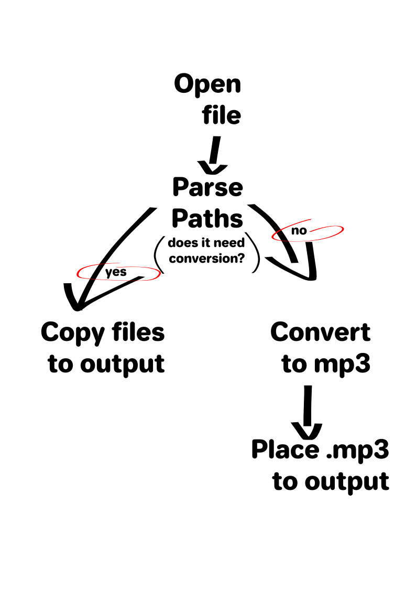

# Playlist Helper

## Introduction
I love doing playlists, but I always find a hardtime to transfer their associated files to my external devices. To solve that I thought on doing a small .py script that can handle the problem.

The solution is pretty easy and its based on the contents of the playlist file, I also added a prompt to check if the user needs to also convert the files to mp3 or not.

## Transforming the Playlist

What is a playlist? I guess it depends on what type of playlist do you have, but at least with .m3u files, what you get is pretty simple. The contents of every .m3u is a PATH to the file and the metadata associated with it, in the order that the playlist is supossed to play.

For example:

```
#EXTINF:305,1 Black Sabbath - Sweet Leaf (Master of Reality)
/home/user/Music/1971 Master Of Reality (Black Box Remaster)/01 Sweet Leaf.flac
#EXTINF:202,9 The Cure - Fire In Cairo (Boys Don't Cry)
/home/user/Music/1980 1986 Boys Dont Cry [SPELP 26] [RE]/B02 Fire In Cairo.flac
#EXTINF:265,6 Del Pueblo y del Barrio - Escalera Al Infierno (Del Pueblo...Del Barrio)
/home/user/Music/1985 Del pueblo...Del barrio/06 Escalera al infierno.mp3
#EXTINF:276,2 Alan Parsons Project, The - Eye in the Sky (Eye in the Sky)
/home/user/Music/[1988] Eye in the Sky/02 Eye in the Sky.m4a
#
```

This is how the first 3 songs from a random playlist look inside the .m3u; this can proof key for our solution, since we have a `PATH` available since the beginning.

### Parsing the .m3u

Handling the .m3u to be of use its not a specially hard task, and I would state that might be one of the easiest things to do on python (at least in comparison to other languages). In my short experience, Python shines for its string handling. If you check the [repo](https://github.com/dcalenzani/playlistHelper) you'll see that the full code looks bigger than it actually is, the working part represents only 30 lines of code, while the rest obeys the need to handle inputs from a short CLI or as arguments at the run call.

*Image 1: Program flow*

We'll check and explain the script next, but the basic idea is use the found data in the playlist `.m3u` file to copy the elements of the playlist to an output directory:

``` 
def main(input_playlist, output_folder, mp3_or_not):
    file_list = []

    with open(input_playlist, 'r') as fhand:
        for line in fhand:
            if line.startswith('/'):
                route = line.rstrip()
                file_list.append(route)

    print(f'We ve found {len(file_list)} files')

    # Create the output folder if it doesn't exist
    os.makedirs(output_folder, exist_ok=True)

    for item in file_list:
        remaining_files = len(file_list) - len(glob.glob(os.path.join(output_folder, '*')))
        print(f"{remaining_files}/{len(file_list)} files left")
        if mp3_or_not == 'N':
            shutil.copy2(item, output_folder)
        elif mp3_or_not == 'Y':
            filename = os.path.splitext(os.path.basename(item))[0]
            mp3_file = os.path.join(output_folder, f'{filename}.mp3')
            subprocess.run(['ffmpeg', '-hide_banner', '-loglevel', 'error', '-i', item, '-codec:a', 'libmp3lame', '-qscale:a', '2', mp3_file], check=True)
```

As you can see, we open a function with three arguments: `input_playlist`,`output_folder`,`mp3_or_not`. These represent the things the user can choose or modify, and are those that the program need to read. 

Inmediately after the function init, we define an empty list through `file_list`, which will be filled with the parsed data to use FFMPEG later. We proceed to open the .m3u file used as `fhand`, we append all the found paths to our empty `file_list`, already parsed by using `rstrip`. Just to sanity check the total files in the playlist. 

### Using the FFMPEG CLI from Python
The for loop in the script is the one in charge of copying the contents of our list into our desired output. The if conditional inside the loop permit us to discern between the need of conversion to .mp3

We created an argument to handle mp3 conversion. There is no need to convert files if you don't want to, so `shutil` uses the PATH to directly copy the files as they are. But, in case you are looking to convert to .mp3 and save some space, or need that format for an specific use case scenario, then we create a function for it. 

This solution requires [FFmpeg](https://ffmpeg.org/), right now is not bundled with it. FFMPEG might be one of the greatest conversion tools on the market, and its FOSS. They always try teaching people assembly to develop mor stuff for FFmpeg and their twitter is fire. 

First we use `filename` to detect the name of the file for the original PATH in the .m3u . Then, we create the path for the output .mp3 using `mp3_file`. Finally, we use the "subprocess" tool to call FFmpeg from the system. Using FFmpeg arguments we create a "query" of some sort to convert our file to an mp3 and place it on the output folder.

## Closing Thoughts
By using the Playlist Helper the task of copying and pasting files from a playlist can be done automatically, which might be one of the solutions that sincronization tools provided in GUI Programs like ITunes, MusicBee, Windows Media Player, use when copying a playlist to your cellphone, disc, etc.

FFmpeg proves to be one of most useful conversion solutions, and by being FOSS it is also and statement of the quality of Open Source Projects and the capacities of this type of licences. Many other conversion tools are actually FFmpeg bundles, with a GUI. I encourage others (and myself) to learn Assembly language and support the FFmpeg project.